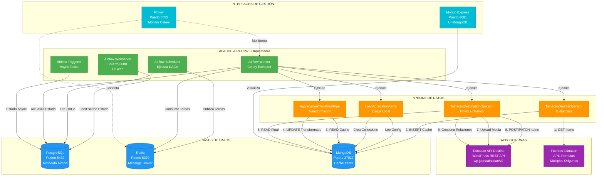
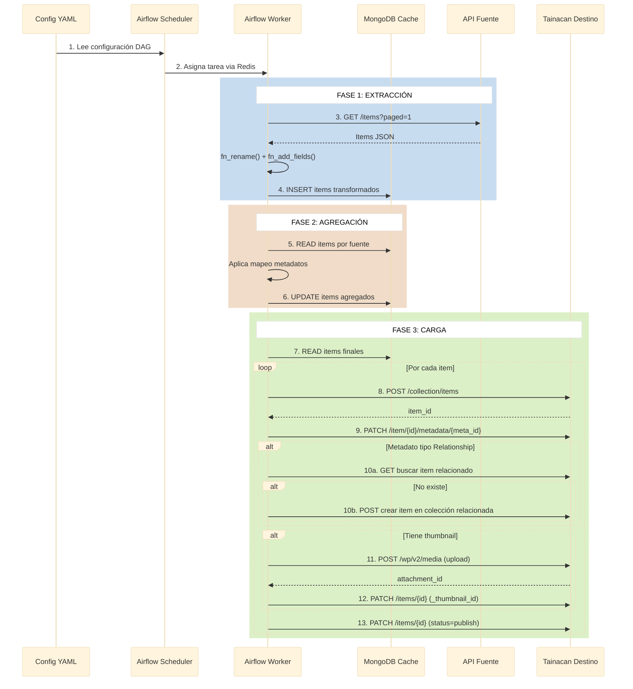
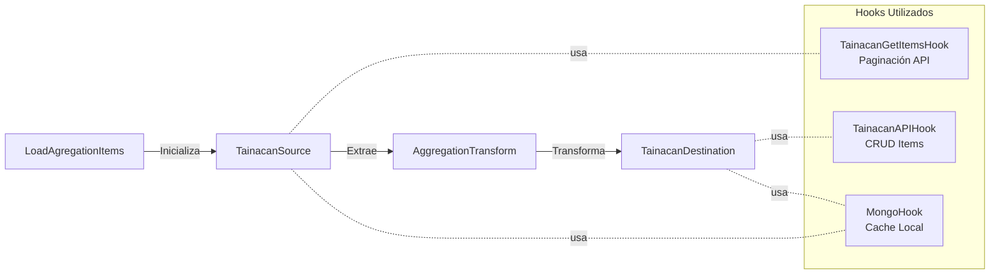
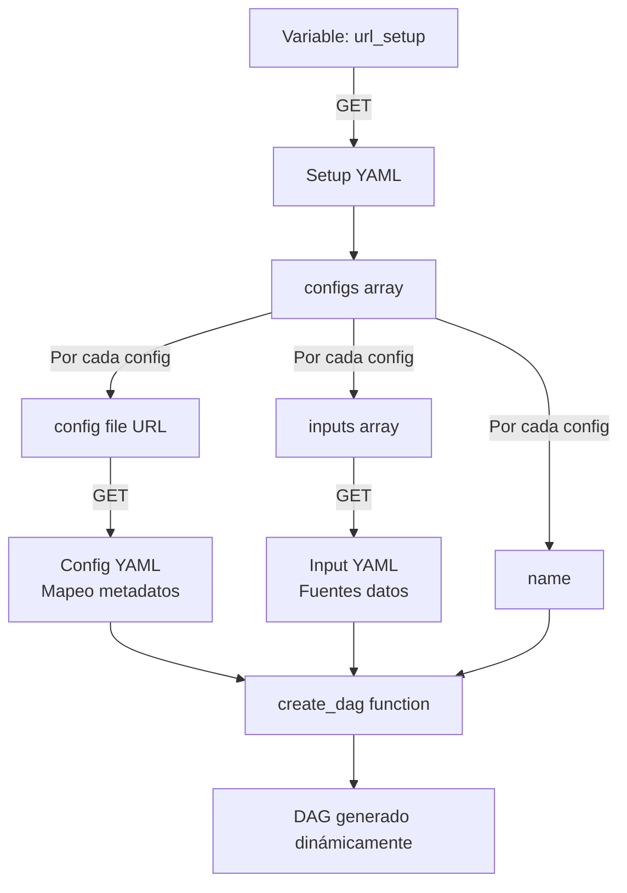

# Arquitectura de Mexicana Repo

## Diagrama de componentes y conexiones



## Flujo de datos detallado



## Componentes y dependencias

### **Airflow Webserver**
- **Puerto**: 8080
- **Función**: Interfaz web para gestionar DAGs
- **Conexiones**:
  - PostgreSQL: Metadata de usuarios, DAGs, ejecuciones
  - Redis: Indirecto (vía workers)

### **Airflow Scheduler**
- **Función**: Orquestador principal de tareas
- **Conexiones**:
  - PostgreSQL: Lee/escribe estado de DAGs
  - Redis: Publica tareas en cola Celery

### **Airflow Worker (Celery)**
- **Función**: Ejecutor de tareas del pipeline
- **Conexiones**:
  - Redis: Consume tareas de la cola
  - PostgreSQL: Actualiza resultados
  - MongoDB: Cache de datos
  - APIs Tainacan: HTTP REST

### **PostgreSQL**
- **Puerto**: 5432
- **Datos**: Metadata Airflow, estado de ejecuciones, logs

### **Redis**
- **Puerto**: 6379
- **Función**: Message broker para Celery
- **Tipo**: In-memory queue

### **MongoDB**
- **Puerto**: 27017
- **Función**: Cache temporal durante agregación
- **Estructura**:
  - Base de datos por configuración (ej: `mexicana_mongo_cache_db`)
  - Colección por fuente de datos (ej: `idsource_fuente1`)

### **Mongo Express**
- **Puerto**: 8081
- **Función**: UI web para inspeccionar MongoDB
- **Credenciales**: `tainacan`/`tainacan`

### **Flower (Opcional)**
- **Puerto**: 5555
- **Función**: Monitor web de Celery workers
- **Activación**: `docker-compose --profile flower up`

## Operators del Pipeline



### **1. LoadAgregationItemsDataOperator**
- Lee configuración de agregación
- Crea estructuras en MongoDB
- Prepara colecciones de cache

### **2. TainacanSourceOperator**
- Conecta con API fuente via `TainacanGetItemsHook`
- Descarga items paginados
- Aplica transformaciones:
  - `fn_rename()`: Mapea campos
  - `fn_add_fields()`: Añade metadata fija
- Guarda en MongoDB cache

### **3. AggregationTransformPipeOperator**
- Lee items de MongoDB
- Aplica mapeo de metadatos según configuración
- Normaliza valores
- Actualiza cache con datos transformados

### **4. TainacanDestinationOperator**
- Lee items finales de MongoDB
- Usa `TainacanAPIHook` para:
  - Crear items en colección destino
  - Actualizar metadatos individuales
  - Gestionar relaciones (buscar/crear items relacionados)
  - Subir y asignar thumbnails
  - Publicar items

## Configuración y Dependencias



## Detalles de componentes

### **Redis - Message Broker**

Redis actúa como intermediario de mensajería entre el Scheduler y los Workers en la arquitectura Celery:

**Flujo de trabajo:**

1. **Airflow Scheduler** detecta que es momento de ejecutar una tarea del DAG
2. **Scheduler** serializa la tarea y la publica en una **cola de Redis** (queue)
3. **Redis** mantiene la tarea en memoria hasta que un Worker la consuma
4. **Airflow Worker** (consumidor Celery) escucha constantemente las colas de Redis
5. **Worker** recibe la tarea, la ejecuta, y reporta el resultado al **PostgreSQL**

**¿Por qué Redis?**
- **Velocidad**: In-memory, ideal para colas de alta velocidad
- **Confiabilidad**: Persistencia opcional para no perder tareas
- **Compatibilidad**: Broker estándar de Celery

**Colas en el sistema:**
```
redis://redis:6379/0
└── default queue
    ├── tainacan-agregador-mexicana.get_items
    ├── tainacan-agregador-mexicana.aggregation_transform_pipe
    └── tainacan-agregador-mexicana.insert_data_on_agregation
```
